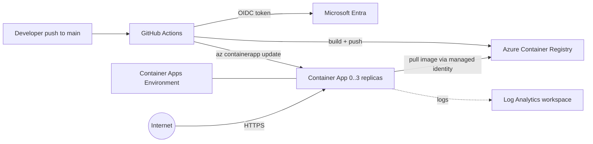

# Azure J2 — Container Apps + GitHub Actions CI/CD

A small Python **Flask** API, containerized and deployed to **Azure Container Apps** with scale-to-zero autoscaling, fronted by a **GitHub Actions** pipeline that builds, scans, pushes, and deploys on every push to `main` — authenticating to Azure with **OIDC** (no long-lived secrets). Infrastructure is **Terraform**; the image lives in **Azure Container Registry**, pulled via a **managed identity** (no registry passwords).

> Built as a hands-on learning project. Everything is parameterized — clone it, point it at your subscription, and ship.

---

## Architecture



### Pipeline stages
```
push to main
  -> quality   ruff (lint) + pytest
       -> sast    Trivy filesystem scan (HIGH/CRITICAL fails the build)
            -> build-push   OIDC login -> docker build -> push to ACR (tag: <sha> + latest)
                 -> deploy   az containerapp update -> /healthz smoke test
```
A failed gate blocks everything downstream. Pull requests run `quality` + `sast` only (no deploy).

---

## What gets created (Terraform)

| Resource | Name pattern | Notes |
|---|---|---|
| Resource group | `rg-j2-dev-weu-001` | standard tags |
| Container Registry | `acrj2devweu001` | Basic SKU, **admin user disabled** (AAD only) |
| Log Analytics | `log-j2-dev-weu-001` | 30-day retention |
| Container Apps env | `cae-j2-dev-weu-001` | Consumption plan |
| User-assigned identity | `id-j2-dev-weu-001-app` | granted **AcrPull** on the registry |
| Container App | `ca-j2-dev-weu-001-notes` | 0-3 replicas, HTTP scale rule (20 concurrent) |

The app's `image` is managed by CI, so Terraform `ignore_changes` it — `terraform apply` and the pipeline don't fight over it.

---

## Repository layout

```
app/
  main.py            Flask API: /healthz, GET/POST /api/notes
  test_main.py       pytest suite (3 tests)
  requirements.txt   flask, gunicorn
  Dockerfile         multistage build on python:3.12-slim, non-root user
  .dockerignore
terraform/
  versions.tf providers.tf variables.tf locals.tf
  rg.tf acr.tf log.tf cae.tf app.tf
  outputs.tf example.tfvars
.github/workflows/
  ci-cd.yml          the pipeline
```

---

## Prerequisites

- An **Azure subscription** (Container Apps idles to 0 replicas — practically free for a lab)
- [Terraform](https://developer.hashicorp.com/terraform/downloads) >= 1.9, [Azure CLI](https://learn.microsoft.com/cli/azure/install-azure-cli), [GitHub CLI](https://cli.github.com/)
- A storage account for Terraform state
- A GitHub repo (for the pipeline)

> **Docker is not required locally.** The image is built either in CI (ubuntu runner) or server-side with `az acr build`.

---

## Setup

### 1. Infrastructure
```powershell
cp terraform/example.tfvars terraform/terraform.tfvars   # edit project/owner if you like

cd terraform
terraform init `
  -backend-config="resource_group_name=<tfstate-rg>" `
  -backend-config="storage_account_name=<tfstate-sa>" `
  -backend-config="container_name=tfstate" `
  -backend-config="key=j2.tfstate"
```

> **Bootstrap image (important).** The Container App needs an image to pull on first create. Build one into ACR *before* the app applies — no local Docker needed:
> ```powershell
> terraform apply -target=azurerm_container_registry.main   # create ACR first
> az acr build --registry $(terraform output -raw acr_name) `
>   --image notes-api:bootstrap --image notes-api:latest ../app
> terraform apply                                            # now the app pulls a real image
> ```

### 2. OIDC federation (no secrets)
```powershell
$APP_ID = az ad app create --display-name "gh-actions-azure-projects" --query appId -o tsv
$SP = az ad sp create --id $APP_ID --query id -o tsv
az role assignment create --assignee-object-id $SP --assignee-principal-type ServicePrincipal `
  --role Contributor --scope "/subscriptions/$(az account show --query id -o tsv)"

# Federated credential for main (subject is case-sensitive!)
az ad app federated-credential create --id $APP_ID --parameters '{
  "name":"j2-main",
  "issuer":"https://token.actions.githubusercontent.com",
  "subject":"repo:<you>/<repo>:ref:refs/heads/main",
  "audiences":["api://AzureADTokenExchange"]
}'
```

### 3. GitHub secrets + variables
```powershell
gh secret set AZURE_CLIENT_ID       --body $APP_ID
gh secret set AZURE_TENANT_ID       --body (az account show --query tenantId -o tsv)
gh secret set AZURE_SUBSCRIPTION_ID --body (az account show --query id -o tsv)
gh variable set ACR_NAME            --body (terraform -chdir=terraform output -raw acr_name)
gh variable set RESOURCE_GROUP      --body (terraform -chdir=terraform output -raw resource_group)
gh variable set CONTAINER_APP_NAME  --body (terraform -chdir=terraform output -raw container_app_name)
```
There is **no `AZURE_CLIENT_SECRET`** — that's the point of OIDC.

### 4. Ship it
```powershell
git push origin main      # triggers the pipeline
gh run watch
```

### 5. Verify
```powershell
$FQDN = terraform -chdir=terraform output -raw app_fqdn
curl "https://$FQDN/healthz"                 # {"status":"ok"}
```

### 6. Tear down
```powershell
terraform -chdir=terraform destroy
```

---

## Reusability — what to change

No hardcoded secrets anywhere. To make it yours:

| Change | Where |
|---|---|
| Project / env / region / instance | `terraform/terraform.tfvars` (drives all names) |
| Replica min/max, CPU/memory, scale rule | `terraform/app.tf` |
| App code & endpoints | `app/main.py` (+ tests) |
| Image name | `IMAGE_NAME` in `.github/workflows/ci-cd.yml` |
| OIDC subject | the federated credential `subject` must match `repo:<you>/<repo>:ref:refs/heads/main` |

---

## Security notes (reviewed before publishing)

- **OIDC, no stored credentials.** GitHub presents a short-lived token; Azure trades it via a federated credential. No `AZURE_CLIENT_SECRET`, no registry password.
- **ACR admin user disabled.** The Container App pulls images using a user-assigned managed identity with the `AcrPull` role.
- **SAST gate.** Trivy scans the filesystem for HIGH/CRITICAL CVEs and fails the build before anything ships.
- **No secrets in the repo.** `*.tfvars`, `*.tfstate`, and `backend.hcl` are gitignored; only `example.tfvars` ships. The provider lock file is committed for reproducibility.
- **Non-root container.** The runtime image runs as an unprivileged user.

---

## Best practices demonstrated

- **Secretless CI/CD with OIDC** — the modern replacement for long-lived service-principal secrets.
- **Per-branch federated credentials** — a workflow on another branch can't impersonate `main`.
- **Quality gates as a DAG** — lint -> test -> SAST -> build -> deploy, each `needs:` the previous.
- **Immutable image tags** — every build is tagged with the commit SHA; `latest` tracks `main`.
- **Managed identity for registry pulls** — no credentials baked into the app.
- **Pinned providers + committed lock file** — reproducible Terraform.
- **Scale-to-zero** — `min_replicas = 0` keeps idle cost near zero.

### Build-it-from-scratch path (if you're learning)

Do it in this order, and **destroy after each milestone** to keep cost near zero and internalize the lifecycle:

1. **App first.** Write the Flask app + `pytest` tests; get them green locally before any cloud.
2. **Containerize.** Write the multistage Dockerfile; build it server-side with `az acr build` (no local Docker needed) and confirm the image is small.
3. **Infra.** Terraform the ACR, Log Analytics, Container Apps environment, the user-assigned identity, and the `AcrPull` role. Apply the ACR first, push a bootstrap image, then apply the app so it has something to pull.
4. **Secretless auth.** Create the OIDC app registration + federated credential; wire the 3 GitHub secrets and 3 variables. Prove there's no `AZURE_CLIENT_SECRET`.
5. **Pipeline.** Add the workflow one job at a time — `quality`, then `sast`, then `build-push`, then `deploy` — pushing and watching each go green before adding the next.
6. **Autoscale + teardown.** Load-test to watch it scale to the cap, confirm it idles back to zero, then `terraform destroy`.

> Tip: pin third-party actions (e.g. `aquasecurity/trivy-action`) to a tag that still exists — supply-chain incidents sometimes remove old tags. Check the action's releases page if a job fails to resolve.

---

## Real-world scenarios where this pattern applies

- **Bursty internal APIs / webhooks** that should cost nothing while idle but handle spikes — scale-to-zero + HTTP scale rule.
- **Microservice deployments** without managing a Kubernetes cluster — Container Apps is the lighter-weight option.
- **Secretless deployment pipelines** mandated by security teams — OIDC removes the long-lived secret that gets leaked.
- **Shift-left security** — a SAST gate that blocks vulnerable dependencies before they reach production.
- **Preview/PR validation** — PRs run lint + tests + scan without deploying, gating merges.

---

## Cost

ACR Basic (~€4/mo) is the only always-on charge. The Container App scales to zero when idle (€0); Log Analytics stays under the free tier for a lab. Typical: **~5-8 €/mo**, or run `terraform destroy` between sessions for ~€0.

---

## License

MIT — see [LICENSE](LICENSE). Swap in your own subscription and OIDC app to reuse.
